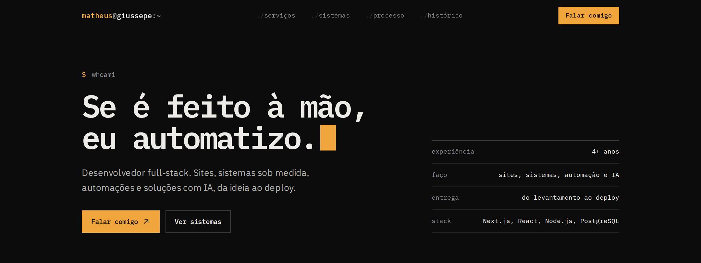

# Matheus Giussepe

**Desenvolvedor full-stack.** Sites, sistemas sob medida, automações e soluções com IA, da ideia ao deploy.

[Ver o portfólio no ar](https://seu-dominio.vercel.app) · [LinkedIn](https://www.linkedin.com/in/matheusgiussepe/) · [WhatsApp](https://wa.me/5547999306802) · [E-mail](mailto:Mgiussepe26@gmail.com)



---

## Quem sou

Sou desenvolvedor full-stack com mais de 4 anos construindo software para empresas e profissionais. Comecei como freelancer em 2022 e, desde 2024, desenvolvo os sistemas internos da Elmo Gestão de Serviços, uma empresa de terceirização de mão de obra.

Resolvo problema de ponta a ponta. Entendo como o negócio funciona, desenho a solução e coloco no ar. Se uma tarefa é feita à mão todo dia, ela pode virar regra no sistema e rodar sozinha.

## O que eu faço

| | |
|---|---|
| **Sites e landing pages** | Rápidos, responsivos e prontos para aparecer no Google. |
| **Sistemas sob medida** | Painéis internos, cadastros, controle de acesso por perfil e relatórios em PDF. |
| **Automação de processos** | Cálculos, conferências e rotinas que passam a rodar sozinhas, com histórico. |
| **Inteligência artificial** | Assistentes e chatbots com base nos dados da empresa, leitura de documentos e classificação automática. |
| **Integrações e APIs** | Sistemas de RH e ponto, ERPs, WhatsApp, pagamentos e bancos de dados conversando entre si. |
| **Parametrização** | Regras, cálculos e fluxos configuráveis, para o sistema acompanhar a empresa sem código novo. |

## Sistemas que eu construí

**Elmosys** · em produção
Sistema de gestão de pessoal para uma empresa de terceirização. Folhas de ponto com ajustes e horas extras, cálculo de vale alimentação, escalas por empresa cliente, boletins em PDF, controle de acesso por usuário e sincronização automática com a Solides.
`Next.js` `Node.js` `PostgreSQL`

**Portaria** · em produção
Controle de portaria para condomínios. Registro de visitantes, prestadores e entregas, acesso dos moradores pelo CPF com código de ativação e histórico de todas as ações da equipe.
`React` `Node.js` `SQLite`

**LessPay** · em desenvolvimento
App que traduz o mundo tributário para pequenas e médias empresas. Mostra quanto do faturamento vai para imposto, dá uma nota de saúde fiscal com missões para melhorar e tem a Lessy, assistente de IA que explica tudo em linguagem simples.
`Next.js` `PostgreSQL`

## Stack

`TypeScript` `JavaScript` `React` `Next.js` `Node.js` `PostgreSQL` `SQLite` `APIs REST` `Vercel`

## Vamos conversar

Tem um projeto em mente ou um processo travando a equipe? Me chama no [WhatsApp](https://wa.me/5547999306802) ou mande um [e-mail](mailto:Mgiussepe26@gmail.com).

---

## Sobre este repositório

Este é o código do meu site de portfólio.

- **Next.js 15** com App Router e TypeScript
- **CSS nativo**, sem framework de estilo: tokens de cor e espaçamento em `app/globals.css`
- **Motion** para as animações de entrada, que ficam desligadas para quem ativa "reduzir movimento" no sistema
- **Conteúdo separado do layout**: todos os textos, serviços e projetos ficam em `content/site.ts`
- Página 100% estática, publicada na Vercel

### Rodando localmente

```bash
npm install
npm run dev
```

Abra `http://localhost:3000`.
